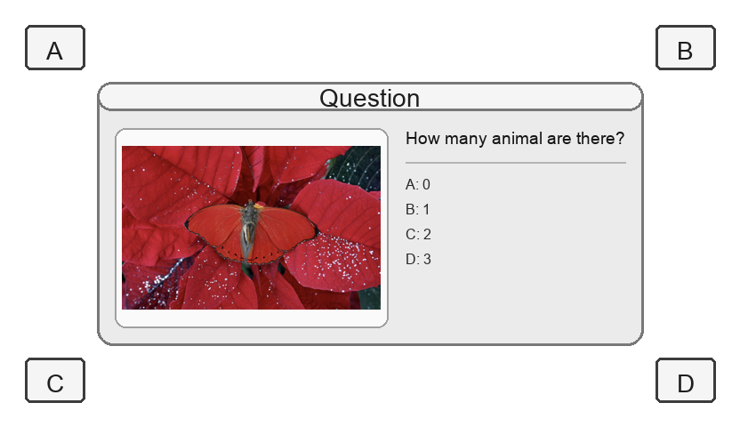
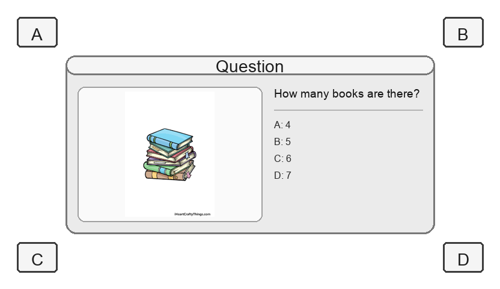
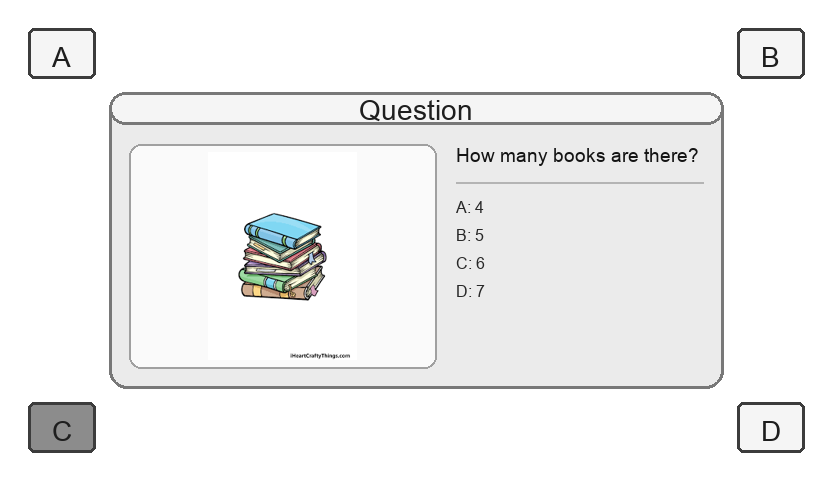

# video-mcp
Model Context Protocol (MCP)-style **Video-MCQA** dataset utilities.

This repo's main output is a **Video-MCP dataset**: short clips where the **prompt UI is part of the video** and the **answer is expressed by highlighting A/B/C/D** in later frames.

Output follows the **[VBVR DataFactory](https://github.com/video-reason/VBVR-DataFactory)** directory convention so that generated data is directly compatible with the VBVR pipeline.

For the authoritative spec, see `docs/VIDEO_MCP_DATA.md`.

## Demo samples (CoreCognition)

**First frame** (no answer highlight -- the model "reads" the question):

| Sample 1 | Sample 2 |
|---|---|
|  |  |

**Final frame** (correct answer fully highlighted -- B and C respectively):

| Sample 1 (Answer: B) | Sample 2 (Answer: C) |
|---|---|
|  |  |

The full `ground_truth.mp4` smoothly transitions from the first frame to the final frame over 81 frames (~5 seconds).

## Quickstart

### 1. Setup

Create a venv and install dependencies:

```bash
python -m venv venv
source venv/bin/activate
python -m pip install -r requirements.txt
```

Create `.env` (local, gitignored) with at least:

```bash
HF_TOKEN=...
```

### 2. Download and process

**IMPORTANT:** Always activate the venv before running commands:

```bash
source venv/bin/activate
```

Download raw data and build processed Video-MCP outputs:

```bash
python -m video_mcp.dataset download --dataset corecognition
python -m video_mcp.dataset process  --dataset corecognition
```

Quick test run (50 samples):

```bash
python -m video_mcp.dataset download --dataset scienceqa
python -m video_mcp.dataset process  --dataset scienceqa --limit 50
```

### Video specifications (Wan2.2-I2V-A14B)

Default output specs are aligned with **Wan2.2-I2V-A14B** fine-tuning requirements:

- **Resolution**: 832x480 (480p tier)
- **Frames**: 81 @ 16 FPS (~5 seconds)
- **Codec**: H.264, yuv420p, MP4 container

Override with CLI flags:

```bash
# 720p, 81 frames (higher quality, more VRAM)
python -m video_mcp.dataset process --dataset corecognition --width 1280 --height 720

# 480p, 49 frames (lighter runs)
python -m video_mcp.dataset process --dataset corecognition --num-frames 49
```

**Constraints** (enforced by Pydantic validators):
- Width and height must be divisible by **8** (VAE spatial compression)
- Frame count must satisfy **1 + 4k** where k >= 0 (VAE temporal compression): 1, 5, 9, 13, ..., 49, ..., 81

### Additional options

- `--limit N` -- Build only the first N samples (useful for quick testing)
- `--lit-style darken` (default) or `--lit-style red_border` -- How the correct answer is highlighted

### Requirements

- `ffmpeg` must be on the system PATH (used to compile frames into MP4 video)

## Output format (VBVR-compatible)

All outputs follow the **VBVR DataFactory** directory convention:

```
questions/
└── M-1_corecognition_data-generator/
    ├── clip_config.json
    └── corecognition_task/
        ├── corecognition_0000/
        │   ├── first_frame.png          # rendered frame 0 (no answer highlight)
        │   ├── prompt.txt               # question + choices + answer (plain text)
        │   ├── final_frame.png          # rendered last frame (answer fully highlighted)
        │   ├── ground_truth.mp4         # full clip with progressive answer reveal
        │   └── original/
        │       ├── question.json        # structured metadata (Pydantic)
        │       └── <source_image>.png   # raw VQA image from dataset
        ├── corecognition_0001/
        │   └── [same structure]
        └── ...
```

**Structure breakdown (VBVR convention):**
- **Root:** `questions/` -- all generated data
- **Generator:** `{generator_id}_{name}_data-generator/` -- e.g. `M-1_corecognition_data-generator/`
- **Task:** `{name}_task/` -- task-specific directory
- **Instances:** `{name}_{NNNN}/` -- individual samples with 4-digit zero-padded indices
- **VBVR files:** `first_frame.png` and `prompt.txt` are required; `final_frame.png` and `ground_truth.mp4` are optional
- **original/** -- video-mcp extra: preserves source data for traceability (invisible to VBVR validator)

### Frame layout

Each frame uses a **two-column panel** (image on left, question + choices on right)
with A/B/C/D answer boxes in the four corners of the frame.

- **first_frame.png** (frame 0): Question panel visible, no answer highlighted.
- **final_frame.png** (last frame): Correct answer fully highlighted.
- **ground_truth.mp4**: Full clip -- progressive answer reveal across all frames.

### Highlight styles (`--lit-style`)

| Style | Effect |
|---|---|
| `darken` (default) | Correct corner box gradually darkens |
| `red_border` | Thick red outline gradually appears around the correct corner box |

### prompt.txt format

```
What color is the object in the image?

A: Red
B: Blue
C: Green
D: Yellow

Answer: A
```

## Registered generators

| Generator ID | Name | Dataset | HF Source |
|---|---|---|---|
| `M-1` | `corecognition` | CoreCognition | `williamium/CoreCognition` |
| `M-2` | `scienceqa` | ScienceQA | `derek-thomas/ScienceQA` |
| `M-3` | `mathvision` | MathVision | `MathLLMs/MathVision` |
| `M-4` | `phyx` | PhyX | `Cloudriver/PhyX` |

See [docs/DATASET.md](docs/DATASET.md) for detailed status and commands per dataset.

## Adding a new dataset

Every dataset lives in its own file under `video_mcp/datasets/`. The generic
processing pipeline (`process/`), CLI, and all build scripts work with any
dataset automatically -- you never need to touch them.

### 1. Create the adapter file

Create `video_mcp/datasets/<name>.py` (e.g. `video_mcp/datasets/mydataset.py`).

Your file must define a class that inherits from `DatasetAdapter` and implements
four methods:

| Method | Purpose |
|---|---|
| `name` (property) | Short slug used in `--dataset` flags, e.g. `"scienceqa"` |
| `generator_id` (property) | VBVR-style prefix, e.g. `"M-2"` |
| `download(*, out_dir)` | Download the raw data and return the local path |
| `iter_mcqa_vqa()` | Yield `(McqaVqaSample, image_bytes)` pairs |

Minimal skeleton:

```python
from __future__ import annotations

from pathlib import Path
from typing import Iterator

from video_mcp.process.adapter import (
    DatasetAdapter,
    McqaVqaSample,
    register_adapter,
)


@register_adapter("scienceqa")
class ScienceQaAdapter(DatasetAdapter):

    @property
    def name(self) -> str:
        return "scienceqa"

    @property
    def generator_id(self) -> str:
        return "M-2"

    def download(self, *, out_dir: Path) -> Path:
        # Download or locate the raw data; return the artifact path.
        ...

    def iter_mcqa_vqa(self) -> Iterator[tuple[McqaVqaSample, bytes]]:
        # Yield (sample, image_bytes) for every MCQA-VQA example.
        ...
```

This would produce output at:
```
questions/M-2_scienceqa_data-generator/scienceqa_task/scienceqa_0000/
```

See `video_mcp/datasets/corecognition.py` for a complete working example, or read the full guide at [docs/ADD_DATASET.md](docs/ADD_DATASET.md).

### 2. Register it

Open `video_mcp/datasets/__init__.py` and add one import line:

```python
from video_mcp.datasets import scienceqa as _scienceqa  # noqa: F401
```

That's it. The new dataset is now available everywhere:

```bash
python -m video_mcp.dataset download  --dataset scienceqa
python -m video_mcp.dataset process   --dataset scienceqa
```

## S3 upload

Processed outputs can be synced to S3 for sharing. Prefer attaching an **IAM role**
to your EC2 instance instead of copying access keys.

If you do use local credentials, ensure your `.env` contains:

```bash
AWS_ACCESS_KEY_ID="..."
AWS_SECRET_ACCESS_KEY="..."
AWS_DEFAULT_REGION="us-east-2"
```

Then load the credentials and sync:

```bash
# Load AWS credentials from .env
source scripts/load_env.sh

# Sync to S3
aws s3 sync questions/ s3://video-mcp/questions/ --delete
```

**Alternative:** Set credentials permanently via `aws configure`, which creates `~/.aws/credentials`.
